# Azure Dev Day - Serverless and event-driven solutions lab 

<!-- TOC -->
**Overview**: 

- [Requirements](#requirements)
- [Step 1: Setup Azure subscription and properties](#step-1-setup-azure-subscription-and-properties)
- [Step 2: Create an Azure Resource Group ](#step-2-create-an-azure-resource-group)
- [Step 3: Create Cosmos DB resources](#step-3-create-cosmos-db-resources)
- [Step 4: Create Function App](#step-4-create-function-app)
- [Step 5: Create Storage Account](#step-5-create-storage-account)
- [Step 6: Ask Azure to wireup events from Blob Storage using Event Grid Topic and call AZ function](#step-6-create-event-grid)
- [Step 7: Event Grid Blob Storage Test](#step-7-event-grid-blob-storage-test)
- [Step 8: Azure Cosmos DB Output Binding](#step-8-azure-cosmos-db-output-binding)
- [Step 9: Azure Cosmos DB Input Binding](#step-9-azure-cosmos-db-input-binding)
- [Step 10: Clean up resources](#step-10-clean-up-resources)
- [Bonus Material](#bonus-material)

<!-- TOC -->

## Objectives 

Azure Serverless offerings provide a wide array of capabilites to drive modern application architectures with zero-infrastructure and capital investments. This lab demonstrates Azure PaaS offerings including: 

- Azure Event Grid
- Azure Function Apps 
- Azure Cosmos DB 
- Azure infrastructure services to include resource groups, storage accounts and familiarization with Azure CLI services

**NOTE: This exercise is a section of a day-long presentation on Azure App Innovation, the complete workshop may be found [here](https://aka.ms/azuredevdaylabs).**

## Requirements

This example assumes the user already has an Azure subscription with contributor access. Additionally, the following services will be required during the lab: 

- Azure CLI, [How to install Azure CLI](https://docs.microsoft.com/en-us/cli/azure/install-azure-cli)
- Git Bash, [Git Download for Windows](https://gitforwindows.org/)

## Step 1: Setup Azure subscription and make sure you can  sign in 

Initial login and subscription setup is a required prerequisite


NOTE: The region location of the Resource Group may be different than the Azure resources 

## Step 2: Create an Azure Resource Group 

  Navigate to the **Resource Groups** from the top main search bar. Select **Create** to create a New Resource Group
  
  Fill all paramters as shown:
  
- Subscription: **your-subscription-name**
- Resource Name: **devdayfeb-rsg** 
- Region: **East US** 


Click on **Review + create** and then confirm final creation

 
 
  
## Step 3: Create Cosmos DB resources

Select your newly created resource group. Then click **Create** Or **Create resources** if this is the first resource your are creating
a Cosmos DB may be accomplished via the [Azure Portal](https://docs.microsoft.com/en-us/azure/cosmos-db/create-cosmosdb-resources-portal), or via the [Azure CLI]


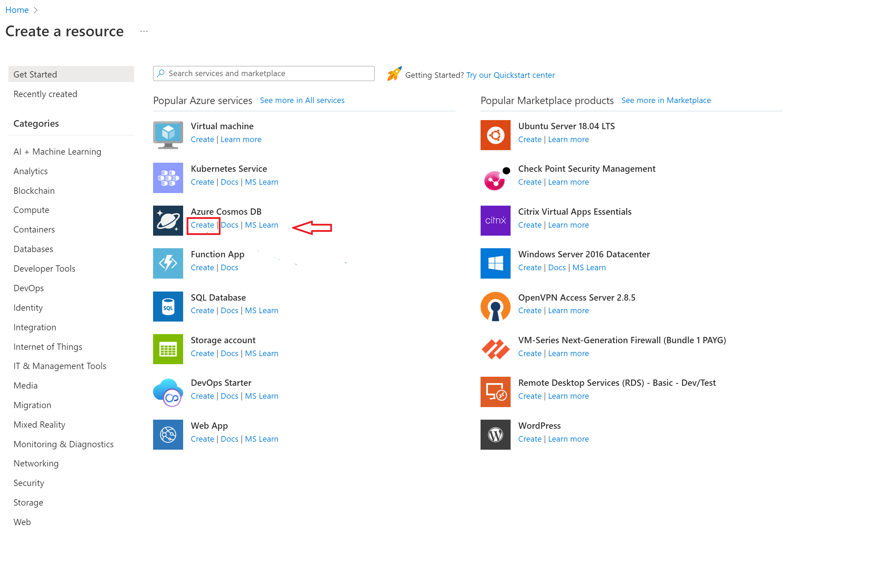

Then select on **Create** Azure Cosmos DB. Cosmos provides different flaovors. Please choose the one with SQL

Fill all the parameters as shown

- Resource Group: **devday-mfa**
- Account Name: **rghosh-cosmos-sql**
- Location: **East US** 
- Capacity Mode: **Provisioned throughput** 
- Other defaults, if necessary

Click on **Review + create** and then confirm final creation

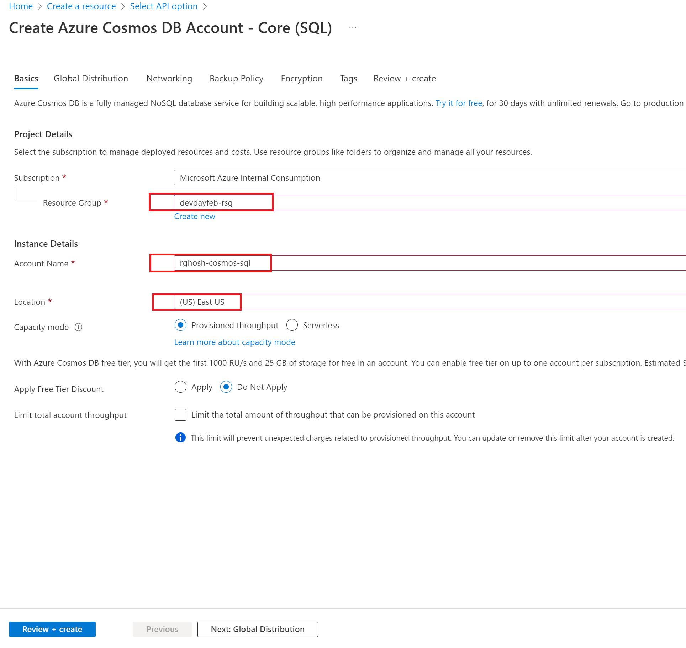


Once created, select the COSMOS DB resource again. Then go and click on **DataExplorer** , then click on **New Container**  (DO NOT CHOOSE Items Container)

Fill all the parameters as shown

- Database Id: **inDatabase**
- D Throughput: **Manual**  with a default of 400 RU
- Container Id: **MyCollection** 
- Partition Key: **/zipCode ** 
- Other defaults, if necessary

Click on **Create** to create our new container.
 
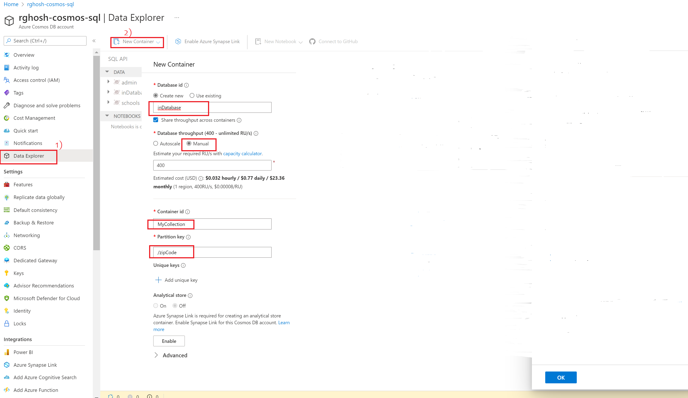
 
## Step 4: Create Function App 
Navigate to the Resource Group created previously, select Create Resource 


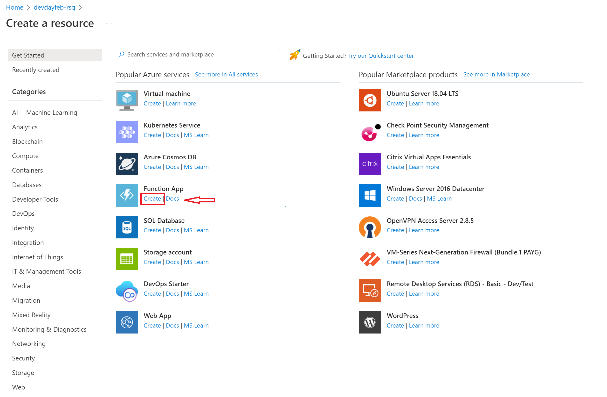

Then select on **Create** Function App

Fill all the parameters as shown:

- Function App Name: **devday-mfa**
- Publish: **Code** 
- Runtime Stack: **Node.js** 
- Version:**14 LT**

Click on **Review + create** and then confirm final creation

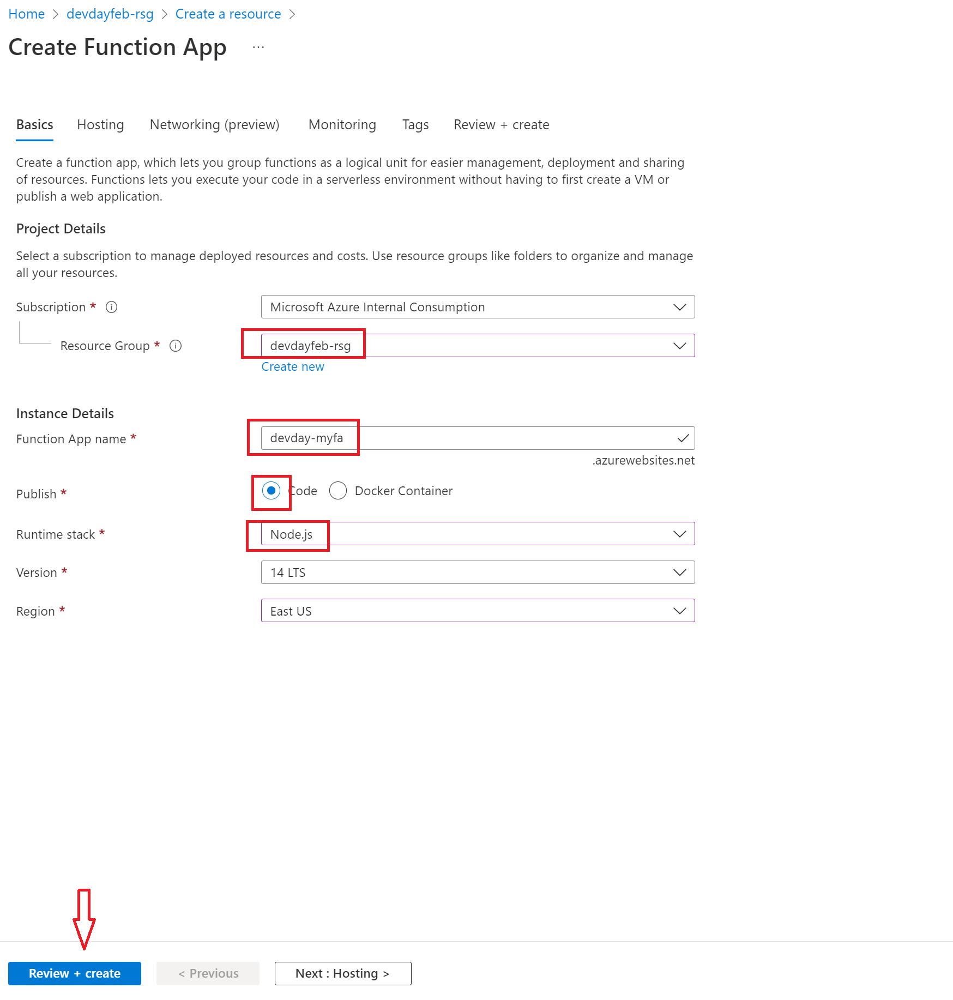

## Step 4A: Add Function(Method 1) for your HttpTrigger 
Once the deployment is complete, select **Go to resource**
OR
Select your Function App, click on **Functions**, then Create a new Function

- Development Environment: **Develop in portal**
- Choose template:  
- Filter : **Http** 
-  Select **Http Trigger** template
- New Function Name: **HttpTrigger1**
- Authorization level: **Function**

Click on **Create** and finish

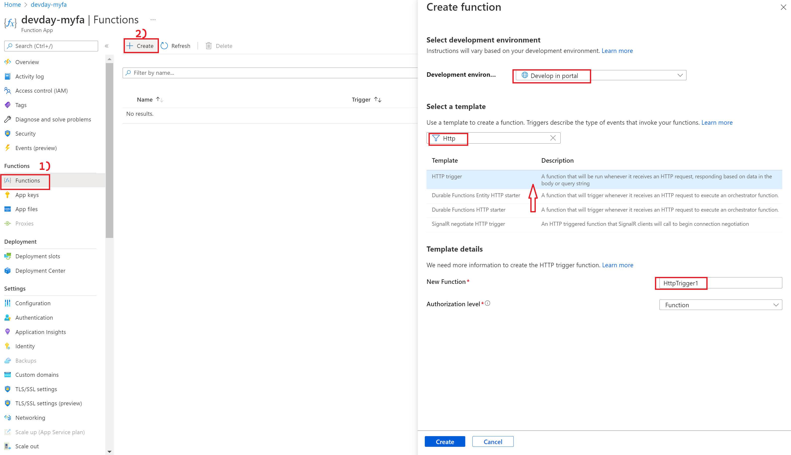

## Step 4B: Add Function(Method 2) for your EventGrid
Select your Function App, click on **Functions**, then click on **Create** a new Function

- Development Environment: **Develop in portal**
- Choose template: 
- Filter : **grid** 
- Select **Event Grid Trigger** template
- New Function Name: **EventGridTrigger1**

Click on **Create** and finish


## Step 4C: Verify both the functions (methods) show up and they are enabled

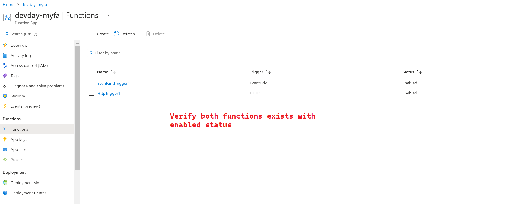


### Step 5: Create Storage Account 


Navigate to the Resource Group created previously, select Create Resource 


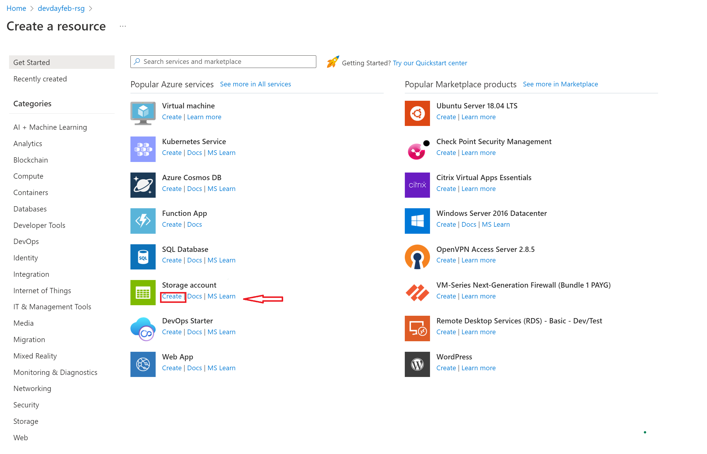


Then select on **Create** Storage Account

Fill all the parameters as shown:

- Storage Account Name: **devdayfebmystorage**
- Region : **East US**
- Performamcnce: **Standard** 
- Redundancy: **Geo redundancy** 

Click on **Review + create** and then confirm final creation

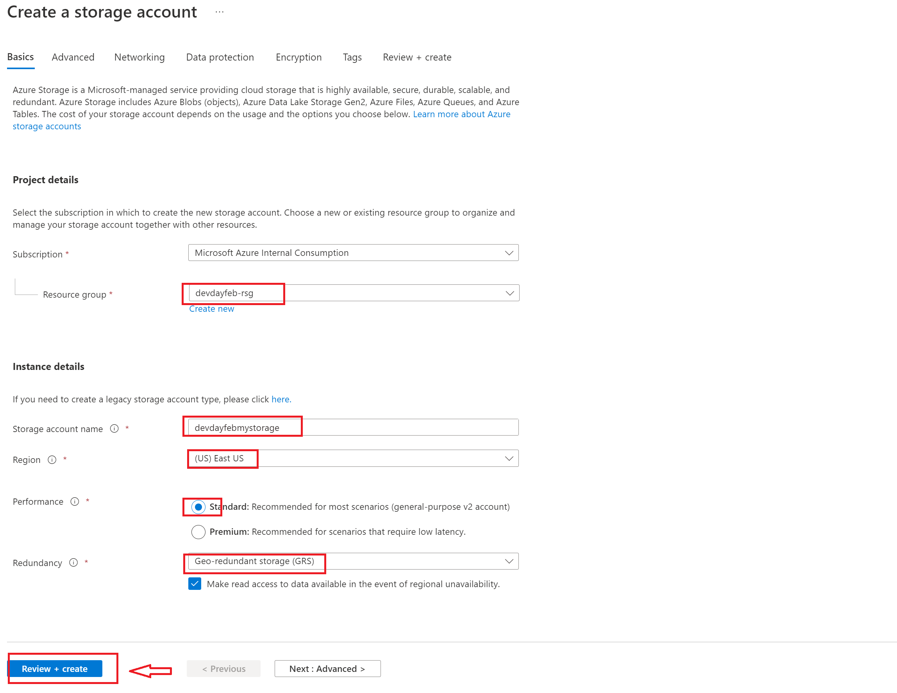


## Step 6: Ask Azure to wire up this Blob Storage Account to emit Events when a new blob is added to this container

Important steps to follow, please pay attention.


### Step 6a: Ensure the Azure subscription has **Registered** the *Microsoft.EventGrid resource provider* 

- Navigate in the Azure portal to the **Subscription**
- Select the **Settings->Resource providers**
- Filter on **EventGrid** 
- **Verify** or **Check**: **Status=Registered**

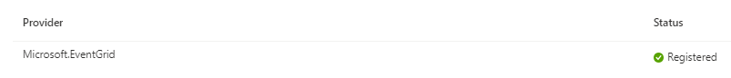

### Step 6b: Ask Azure to create a Event Subscriber(consumer) to trap events, push to EventGrid Topic and then call our Azure Function for post processing 

Navigate to the Resource Group created previously, select the **devdaymystorage** storage account, Click on **Events** 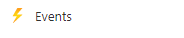 icon and thenk click on **Event Subscription** on top, to create a new consumer. 

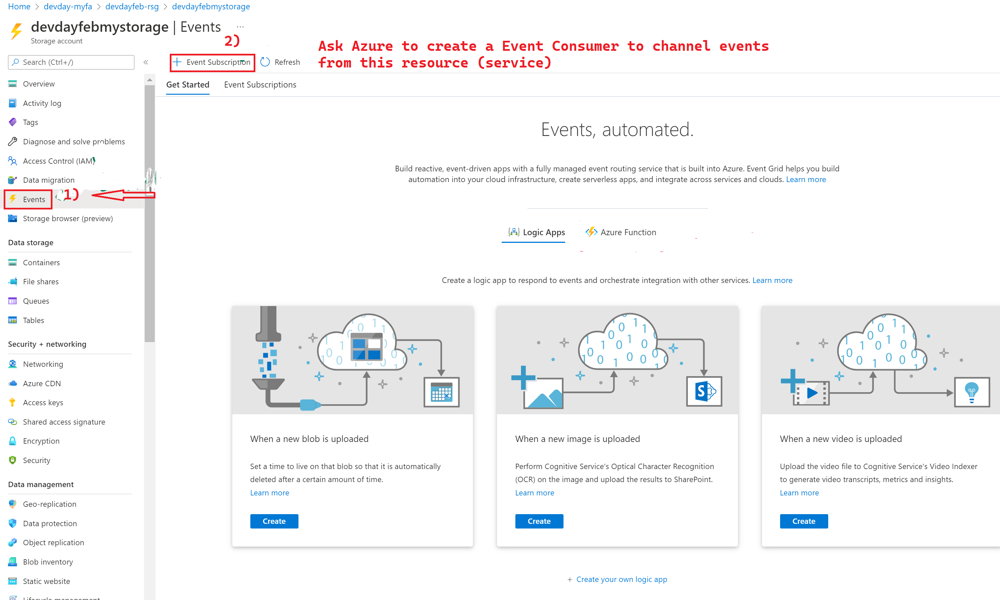

Fill all the parameters as shown:


- Name: **eventgrid-consumer**
- Event Schema: **Event Grid Schema** 
- System Topic Name: **devday-my-topic**
- Filter to Event Types: default to **2 selected**, or as desired
- Endpoint Type: **Azure Function** , select from the drop-down list
- Endpoint: **select endpoint** (Click and navigate to another right window and select the desired FunctionApp and select the default **Function Name**  

Then click **Confirm Selection** for the endpoint and then click on **Create** for completion.

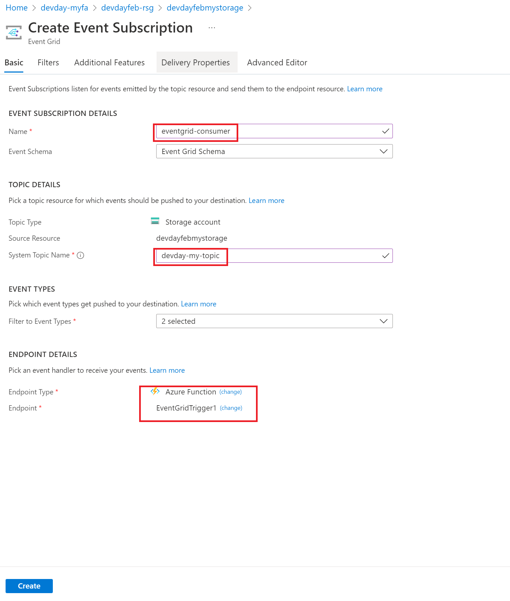 


### Step 7: Event Grid Blob Storage Light Test

Current status is the following have been created and ready for testing: 

- Azure Blob storage account 
- Event Grid Topic created by Azure
- Function App to receive and log events 

Next step is to create an blob container, upload files and verify the Event Grid System Topic triggers the Function App 

- Navigate to the Resource Group, select our Blob storage account **devdayfebmystorage**
- Select: **Containers**, **+ Add Container**
- Name: **test**, 
- Access level: **default** or **as desired** 

Click on **Review + create** and then confirm final creation

Open a second browser session in the Azure Portal:
- Session 1: Navigate to the newly created **test** container1
- Session 2: Navigate to the Function App, **EventGridTrigger1**, and open the **Logs** menu, to view the Function logs 
- **Blob container**, select **Upload**, upload a favorite file, image or related media:

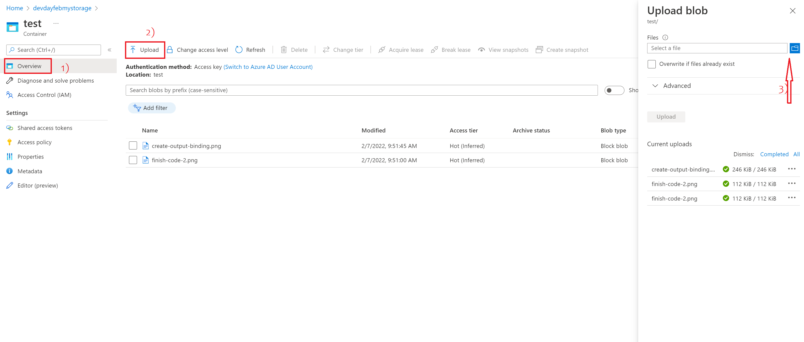 

-  **EventGridTrigger1**, observe for each image, Event Grid will trigger the Fuction, **Logs** will reflect the Event Grid trigger content: 

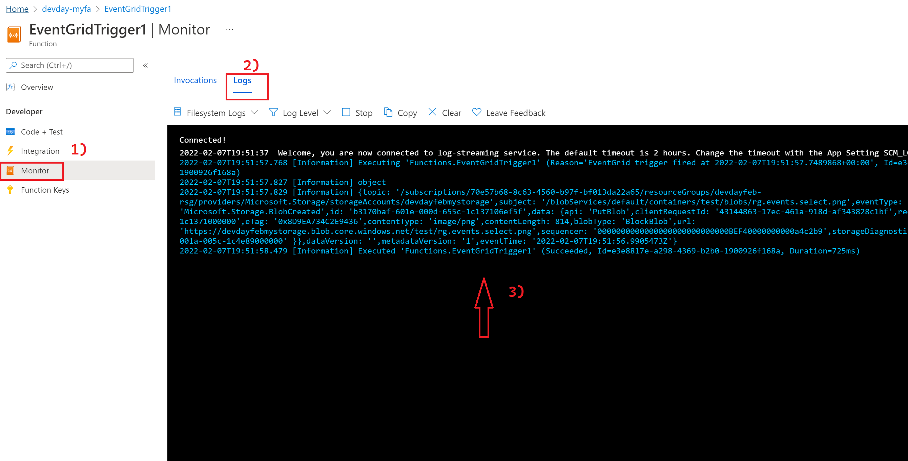 


## Step 8: Azure Cosmos DB Output Binding

The next step in the application architecture is to push a document representing the Event Grid event to **Cosmos DB** for subsequent downstream processing. Adding Cosmos DB requires two steps: 

- Adding an **Output Binding** to the **EventGridTrigger1**
- Updating the  **EventGridTrigger1** function to emit the events into Cosmos DB 

### Step 8.a: Create an Output Binding For the EventTrigger1

Navigate to the **EventGridTrigger1**, select **Integration** and **Add output**: 
- Binding Type: **Azure Cosmos DB**, select **New**, **Cosmos DB account connection**, and link to Cosmos DB account created earlier in the resource group
- Document parameter name: **outputDocument** (case sensitive and must match the outputDocument property in the function 
- Database name: **inDatabase** (as desired)
- Collection name: **MyCollection** (as desired) 
- If true, ..: **Yes** 
- Cosmos DB account connection: **select Cosmos DB account created earlier**  


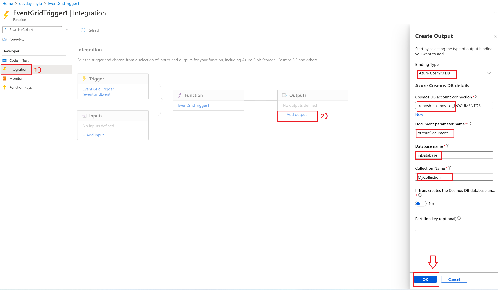 


### Step 8.b: Update Azure Function to set the output binding with the input data being passed

**EventGridTrigger1\index.js** with **outputDocument** set to emit to Cosmos DB output binding: 

````shell

module.exports = async function (context, eventGridEvent) {
    context.log(typeof eventGridEvent);
    context.log(eventGridEvent);

    context.bindings.outputDocument = eventGridEvent.data;
};

````

### Step 8.c: Azure Cosmos DB Output Binding Test 

The next step is repeat of [Step 6](#step-6-event-grid-blob-storage-test) with an additional verification. Set up browsers as described previously, and upload a desired file into the **container 1**: 

- Verify the **EventGridTrigger1** triggers successfully via the **Logs** 
- Navigate to the Cosmos DB **Data Explorer**, select the **MyCollection**, **Items** document
- Verify the corresponding event id from the event grid trigger function matches and successive changes to the blob storage trigger updates to items in the Cosmos DB

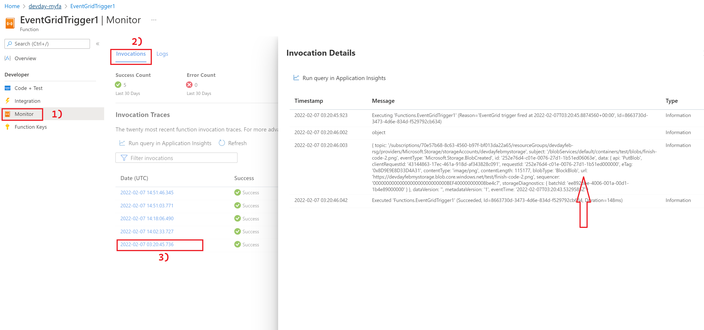 

The previous example demonstrates the relationship and services to connect Azure Event Grid to Azure Functions and then persist data in Azure Cosmos DB for an example of an event-driven architecture using **Azure Serverless offerings** 

--------------------------------------

## Step 9: Azure Cosmos DB Input Binding for HttpTrigger1

The next step in the application architecture is to read documents representing the Event Grid event from **Cosmos DB** for subsequent downstream processing. Adding Cosmos DB requires two steps: 

- Adding an **Input Binding** to the **HttpTrigger1**
- Updating the  **HttpTrigger1** function to read all items from the collection in the Cosmos DB 


### Step 9.a: Azure Cosmos DB Output Binding

Navigate to the **HttpTrigger1**, select **Integration** and **Add output**: 
- Binding Type: **Azure Cosmos DB**, select **New**, **Cosmos DB account connection**, and link to Cosmos DB account created earlier in the resource group
- Document parameter name: **inputDocument** (case sensitive and must match the outputDocument property in the function 
- Database name: **inDatabase** (as desired)
- Collection name: **MyCollection** (as desired) 
- If true, ..: **Yes** 
- Cosmos DB account connection: **select Cosmos DB account created earlier**  


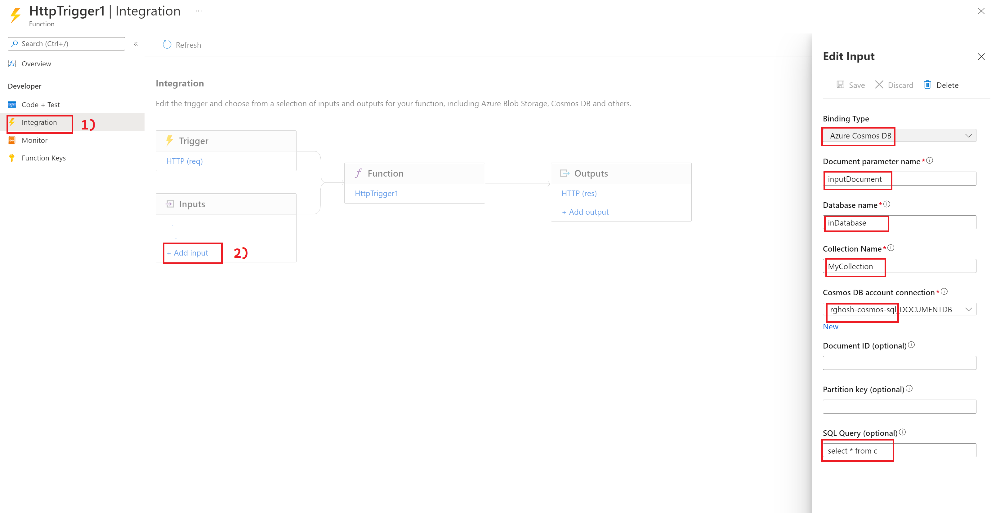 


### Step 9.b: Update Azure Function to set the output binding with the input data being passed

**Httprigger1\index.js** with **outputDocument** set to emit to Cosmos DB output binding: 

````shell

module.exports = async function (context, req) {
    context.log('JavaScript HTTP trigger function processed a request.');

    context.res = {
        // status: 200, /* Defaults to 200 */
        body: context.bindings.inputDocument
    };
}

````

### Step 9.c: Azure Cosmos DB Input Binding Test 

The next step is repeat of [Step 6](#step-6-event-grid-blob-storage-test) with an additional verification. Set up browsers as described previously, and upload a desired file into the **container 1**: 
- Run the Test/Run option and use GET instead of POST. Make sure you r seeing 200 Success
- Verify the **HttpTrigger1** triggers successfully via the **Logs** 

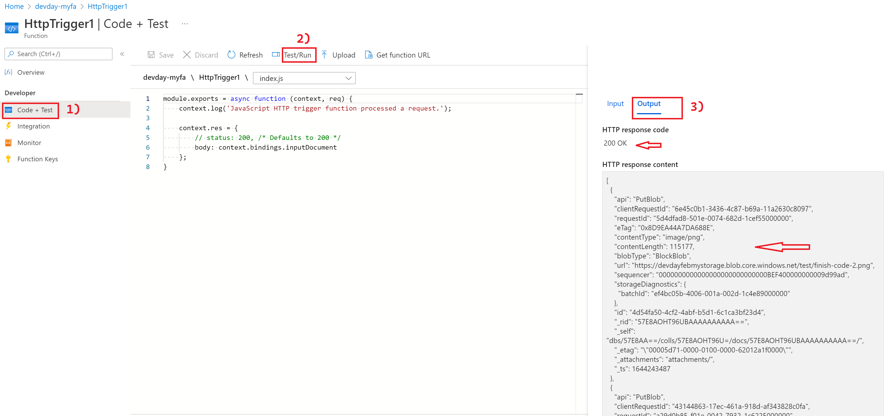 

The previous example demonstrates the relationship and services to connect Azure Event Grid to Azure Functions and then persist data in Azure Cosmos DB for an example of an event-driven architecture using **Azure Serverless offerings** 

## Step 10: Clean up resources and finish

Select your resource group **devdayfeb-rsg** and delete. Remember to confirm all the resources in it.

## Bonus Material 

Want to accelerate and test your understanding of the various tools, integrate Azure Functions, Azure Kubernetes by adding KEDA auto-scaling. Find the [Bonus Material here](https://github.com/garyciampa/azure-dev-day-serverless/blob/main/BonusMaterial/readme.md)
