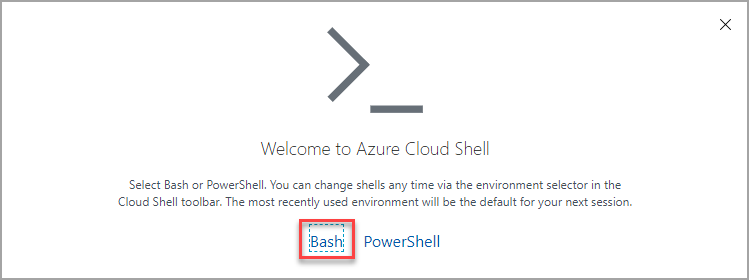
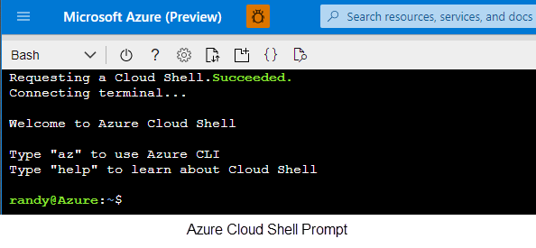
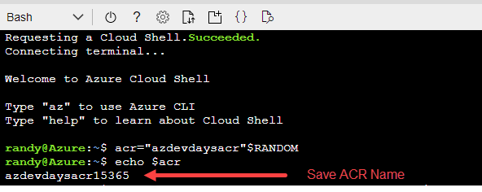
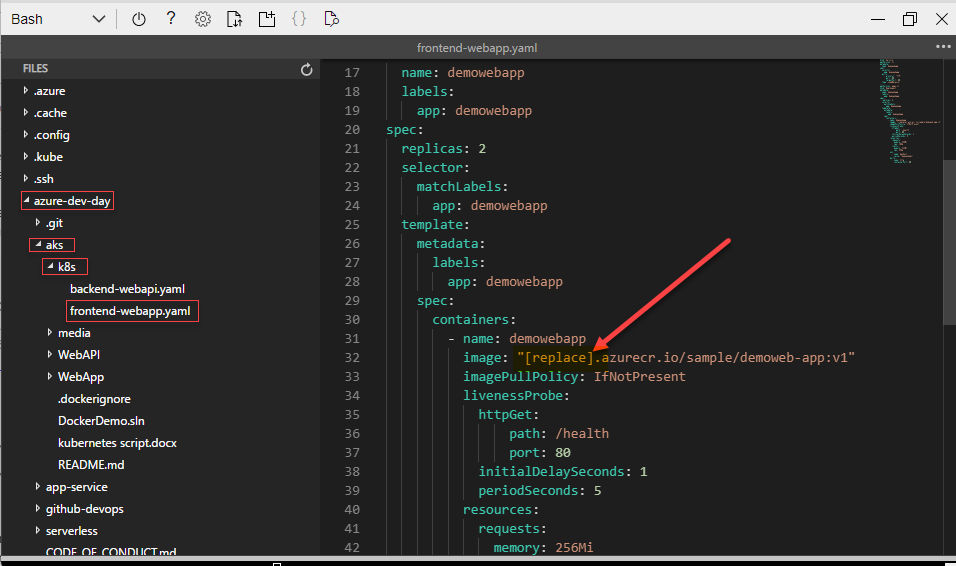
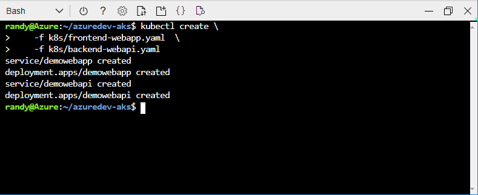
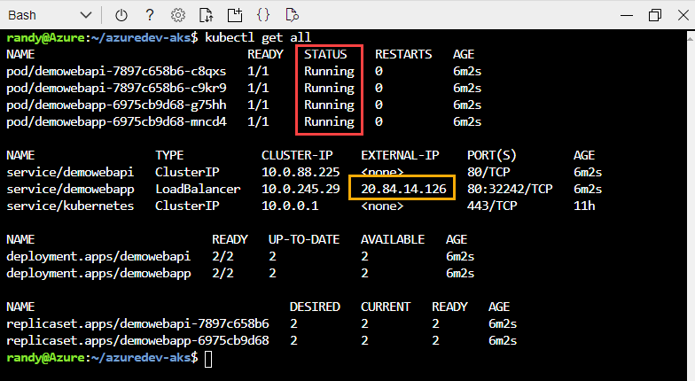
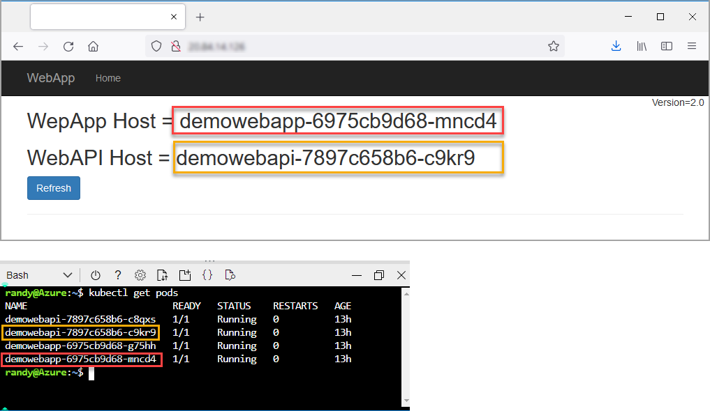
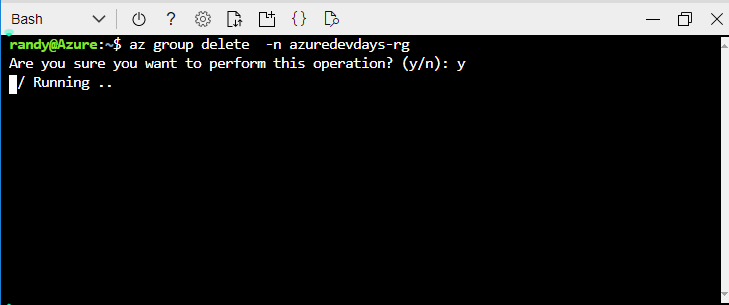

# Azure Dev Day - Microservice solutions lab
>Duration 45 minutes

# Table of contents 

- [Task 1 - Login to Azure Cloud Shell](#task-1---login-to-azure-cloud-shell)
- [Task 2 - Create a Container Registry](#task-2---create-a-container-registry)
- [Task 3 - Create an Azure Kubernetes Cluster](#task-3---create-an-azure-kubernetes-cluster)
- [Task 4 - Build and Push images](#task-4---build-and-push-images)
- [Task 5 - Deploy application to AKS](#task-5---deploy-application-to-aks)
- [Cleanup Resources](#cleanup-resources)


**Objectives**

This lab provides walkthroughs on various Kubernetes topics:  

  - Creating an Azure Container Registry
  - Creating an AKS cluster linked to a Container Registry
  - Creating Docker images
  - Deploying a Microservice application to AKS


---
## Task 1 - Login to Azure Cloud Shell
In this exercise you log into your Azure Subscription and launch the Bash [Azure Cloud Shell](https://docs.microsoft.com/en-us/azure/cloud-shell/overview). The Azure Cloud Shell will give you a Linux shell prompt with all the required software installed and configured.  

1. [Launch Cloud Shell](https://shell.azure.com)  (https://shell.azure.com)
1. When prompted, Log into your Azure Subscription 
1. If this is your first time launching the Azure Cloud Shell, you will need to create a storage account. 

    1. Choose Bash shell

         
    
    1. Create Cloud Storage
    
            

        
        > Use ***shift+insert*** to paste the commands from this document into the cloud shell terminal

## Task 2 - Create a Container Registry

1. First, generate a unique name and create a resource group to organize the resources we will create in the Lab.  An Azure resource group is a logical container into which Azure resources are deployed and managed.

    ```bash
    rg="azdevdays"$RANDOM"-rg"
    echo "rg: " $rg
    az group create -n $rg --location eastus
    ```

1. Generate a unique name for the container registry 

    ```bash
    acr="azdevdaysacr"$RANDOM
    echo "ACR: " $acr
    ```

    > The Azure Container Registry name is unique to you and will be needed later.  Please save the name for later use. Your ACR Name will be different than the one shown below. 

    

1. Next, create an Azure container registry in the Resource Group we created in the previous step.

    ```bash 
    az acr create -g $rg --n $acr --sku Basic
    ```

## Task 3 - Create an Azure Kubernetes Cluster 

1. Create an AKS Cluster and link it to the Container Registry created in Exercise 2

    ```bash 
    az aks create \
        -n azuredevdays-aks \
        -g $rg \
        --generate-ssh-keys \
        --attach-acr $acr \
        --node-count 1 \
        --disable-rbac
    ```
> This can take several minutes to complete 

2. Update cloud shell with your AKS credentials 

    ```bash
    az aks get-credentials --resource-group $rg --name azuredevdays-aks
    ```

## Task 4 - Build and Push images
In this task you will clone the Github repository hosting the sample application consiting of two containers, a Docker file to build the container images and Kubernetes YAML files to deploy the application to AKS


<div style="border-radius: 25px; background: lightblue;padding: 20px; margin: 15px 0 15px 0" > 

<div>NOTE:</div>
The Dockerfile used in the following example depends on a public base container image from Docker Hub. To improve reliability when using public content, import and manage the image in a private Azure container registry, and update your Dockerfile to use your privately managed base image. <a href="https://docs.microsoft.com/en-us/azure/container-registry/buffer-gate-public-content">Learn more about working with public images</a>

</div>
</br>
</br>

1. Clone the Github repository

    ```bash
    git clone https://github.com/microsoft/azure-dev-day.git
    cd ~/azure-dev-day/3-microservice-lab/
    ```

2. Build the Web App front-end image and upload to Container Registry

    ```bash
    az acr build \
        --image sample/demoweb-app:v1 \
        --registry $acr \
        --file ./WebApp/Dockerfile .
    ```

3. Build the API back-end image and upload to the container registry created in 
    ```bash
    az acr build \
        --image sample/demoweb-api:v1 \
        --registry $acr \
        --file ./WebAPI/Dockerfile .
    ```

    > For additional information on the ACR build task see this [Tutorial](https://docs.microsoft.com/en-us/azure/container-registry/container-registry-quickstart-task-cli)
## Task 5 - Deploy application to AKS


1. First, modify the Kubernetes YAML files to include the name of your Azure Container Registry created in [Task 2](#task-2-create-a-container-registry). You can type the command ``` echo $acr ``` to display the name of your Registry

    1. Open the editor using the ```{}``` icon located at the top of Azure Cloud Shell
    1. In the editor, navigate to the direcory **azuredev-aks/3-microservice-lab/k8s** and open the **frontend-webapp.yaml** file and update the string **"[replace]"** for the container image name on line 32 with the name of your container registry 
    1. Save your changes by pressing ```CTRL+S```
    

    1. Next, open the file **backend-webapi.yaml** and update the string **"[replace]"** for the container image name with the name of your container registry 
    

    1. Save your changes by pressing ```CTRL+S``` and exit the editor by pressing ```CTRL+Q```

    1. Finally, deploy the application to your kubernetes cluster 

        ```bash
        kubectl create \
            -f k8s/frontend-webapp.yaml  \
            -f k8s/backend-webapi.yaml
        ```
        

1. Verify application deployed correctly 

    Veify that the application deployed correctly by checking the status of your *Pods*, *Deployemens* and *Replicasets*
    
    ```bash
    kubectl get all
    ```

    Verify that all 4 pods have a status of **Running**. You may have run 
    
    ```kubectl get all``` several times before the status changes to **Running** for all of the pods.  
    
    

    Next, wait for the **EXTERNAL-IP** address for the **service/demowebapp** load balancer to change from *Pending* to an ip address.  You may have to run ```kubectl get services``` several times before the IP Address is assigned and displayed.  

    > NOTE: Your ip address will be different from the one displayed here

    Open your local browser and navigate the the IP Address displayed in **EXTERNAL-IP** to verify the application is running.

    This application will display the name of the *dempwebapp* and the *demowebapi* pods that it is currently connected to.  These names will match the name of the pods displayed using ```kubectl get pods```.  **Refreshing** the page will eventually display different pod names showing that the Load Balancer services (service/demowebapi & service/demowebapp ) are routing requests to different pods.

    

    > **Challenge**: Scale the front-end web app to 4 replicas

    <details>
    <summary>Answer</summary>

    ### Scale the front-end web app to 4 replicas
    One possible solution 
    ```bash
    kubectl scale deployment/demowebapp --replicas=4
    #refreshing the web page should show the additional pod names
    ```
    </details>

---
## Cleanup Resources
when finished you can delete all of the resources this lab created by deleting the resource group 

```bash
az group delete -n $rg     
```
  It can take several minutes for Azure to delete all of the resource. 



Finally, delete the cluster ingformation from your ```kubectl``` config file

```bash
kubectl config delete-cluster azuredevdays-aks
kubectl config delete-context azuredevdays-aks
```
