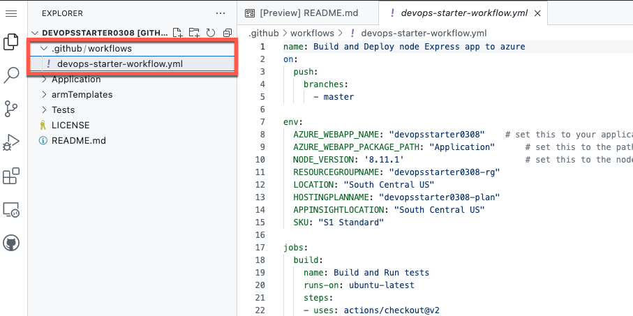
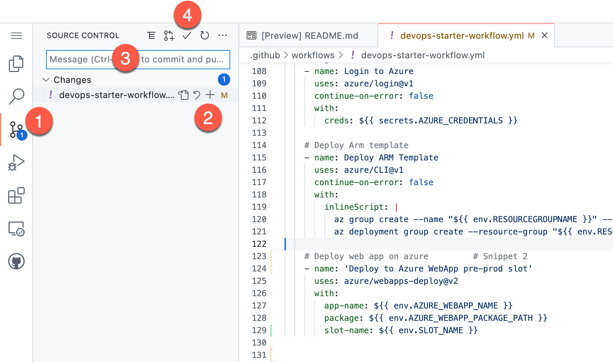
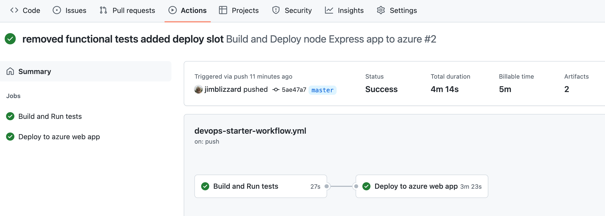
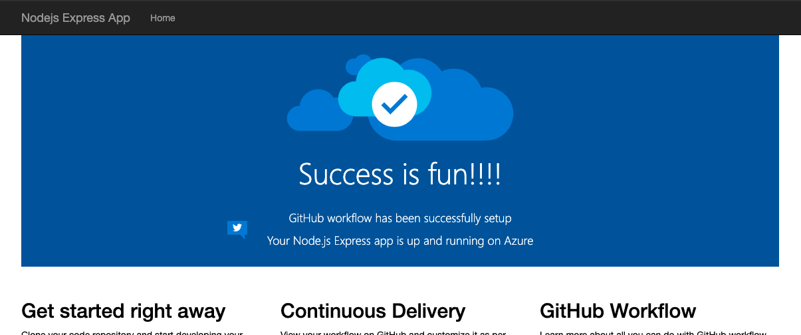

# Azure Dev Day Lab for GitHub DevOps
Located here: <https://github.com/microsoft/azure-dev-day/tree/main/4-devops-lab>

In this lab we're going to see how easy it is to create a functional Azure Web App with its source code stored in GitHub and a GitHub CI/CD workflow that builds and deploys the web app. . . in just a matter of minutes.

*Note: in this location (https://github.com/microsoft/azure-dev-day/tree/main/4-devops-lab) there is a **lab-code-snippets.yml** file that you can use to copy / paste updates into your repository's workflow file instead of having to manually type the the updates.*
## Create DevOps Starter project in Azure

1. Open a browser and sign into the Microsoft Azure Portal at <https://portal.azure.com>
1. In the **search bar**, type **DevOps Starter** and then either **press Return** or **click on DevOps Starter** under **Services**
    
1. Click on **+ Create**

    
1. On the next screen, **make sure that the DevOps Starter is going to use GitHub.** If it isn't, click on the **change settings here** link.

    
1. For this lab, create a Node.js web app that uses Express.js, and runs as a Windows Web App.
    1. Select the **Node.js** box.
    1. Click **Next: Framework >**
        
    1. Select the **Express.js** box. There's no need to add a database. 
    1. Click **Next: Service >**
        
    1. Select the **Windows Web App** box. 
    1. Select **Next: Create >**
        

    1. Click **Authorize** to allow Azure to access your GitHub account & create the workflow.
        
    1. If prompted, enter your GitHub username or email address, and password, then click **Sign in**.
        
    1. Enter your GitHub Organization, Repository, Azure SubScription, Web app name, and Location. 
    1. Click **Review + Create**
        

    Note: It will take a few minutes to create the Azure and GitHub resources. Go grab a soda or some coffee. 

1. Once the deployment completes, click on **Go to resource** to view the deployment. 
    

## View your DevOps Starter project and create a Deployment slot

1. Click on **Authorize** to allow Azure to access your GitHub account to view the latest workflow execution and status of jobs
    
1. Cick on **Authorize** to finish connecting your GitHub account.
    
1. At this point you can see the GitHub workflow and the Azure resources that were created.
1. Click on your App Service name to go to the App Service definition in the Azure portal.
    
1. To create a deployment slot,
    
    1. Click on **Deployment slots**
    1. Click on **+ Add Slot**  
    1. Name the slot **"pre-prod"** NOTE: You'll use the slot name later on when you update your CI/CD pipeline.
    1. Choose Clone settings from: **{your production slot name}**
    1. Click **Add**.
    1. It will take a minute or so to create the pre-prod slot. Once it finishes, click **Close** at the boottom of that window.

### You should now see two slots, the production slot and the new, pre-prod slot


## Update your GitHub workflow to deploy to the pre-prod slot and delete the FunctionalTests job

1. **Open a new tab** and go to your GitHub account. https://github.com/{your-gh-account}
1. Click on **Repositories** to view your repositories. 
    
1. Navigate to the repository that the DevOps Starter created for you by clicking on its name. It's name is the same as the name of the App Service you created. 
    
1. While on the **<> Code** tab, open the lightweight web editor in GitHub by pressing the **period key** on your keybaord, then open the devops-starter-workflow.yml file
    1. Click on **.github/workflows** 
    1. Click on **devops-starter-workflow.yml** to see the CI/CD pipeline that was created by the DevOps Starter project.
    

    The workflow contains three jobs. **build**, **Deploy**, and **FunctionalTests**. We're going to update the workflow to 1) remove the FunctionalTests job, and 2) add a slot swap action. (We're removing the functional tests job because sometimes it takes a while to run. In the real world you would want to keep it.)

1. Scroll to the bottom of the **devops-starter-workflow.yml** file and delete the entire **FunctionalTests** job.
    
1. Add an environment variable called **SLOT_NAME:** with the value of **"pre-prod"** by pasting **Snippet 1** from the **lab-code-snippets.yml** file. Be sure the variable is indented the same as the other enviromnent variables.
    
1. Modify the **web app deploy action** so it deploys to the pre-prod slot instead of the production slot.
    1. Replace the entire **Deploy web app on azure** action (lines 123 through 128) by pasting **Snippet 2** from the snippets file. After pasting the snippet, make sure the columns are indented similar to other actions as shown in the image below.
    

## Commit the changes and watch the updated workflow run

1. Save the changes to the devops-starter-workflow.yml file.
1. Click on the **source control icon** (1) then click the **plus sign** (2) to stage the changes you've made. Click in the **Message** box (3) and type a commit message. Then click on the **check mark** (4) to commit the change to the master branch. Your workflow will immediately start running since it's configured to run anytime anything is pushed to the master branch.
    
1. Return to the traditional GitHub UI by....  (1) In the address bar in your browser, (2) change the "dev" in the URL to "com" and then (3) press enter.

    
1. Click on Actions to go to the Actions tab, then click on the latest workflow to watch it run / view the results. It will take several minutes to complete. Note: In this view, the workflow run name will be whatever you typed for your commit message ("deploy and test pre-prod slot" in this case).
    
    
1. You'll see the current state of the two jobs that are in the workflow. You can click on each job name within the run to see the log messages for it. (If the job is still running you'll be able to see the log messages update in real time.)
    

1. Once the workflow completes, switch back to the Azure Portal tab and from the Deployment slots view, click on the **pre-prod** slot link, then click on the URL for the pre-prod website.

    You should see the Success message on the pre-prod site.  

    
## Extra credit
Update the workflow to do a slot swap, and swap the production and pre-prod slots, then in the source code make a change to the website. Here's the basic outline:

1. Remember: to return to the lightweight web-based editor in GitHub, make sure you're on the **<> Code** tab, then press the **period key** on your keyboard. (You could also replace ".com" in the URL with ".dev" and vice-versa to switch views.)
1. Add new job to the end of the workflow. **Be sure to add** ```needs: Deploy``` to make sure the new job runs after the Deploy job completes. 
1. Add a login to Azure action
1. Add a swap slots action (you'll need to use the Azure CLI to run the command).
1. Add a step to logout of Azure.

    The newly added job should look similar to this (remember -- in **.yml** files, **column alignment is crucial**):

    

1. In the file **Application/views/index.pug** change the **.success-text** message to something such as **p Success is fun!!!!**

    
1. Commit the changes.
1. Watch the workflow run.
1. Once the workflow completes, check the pre-prod website and the production website. The pre-prod website should have the old success message, and the production slot will have the new "Success is fun!!!!" message.
    
