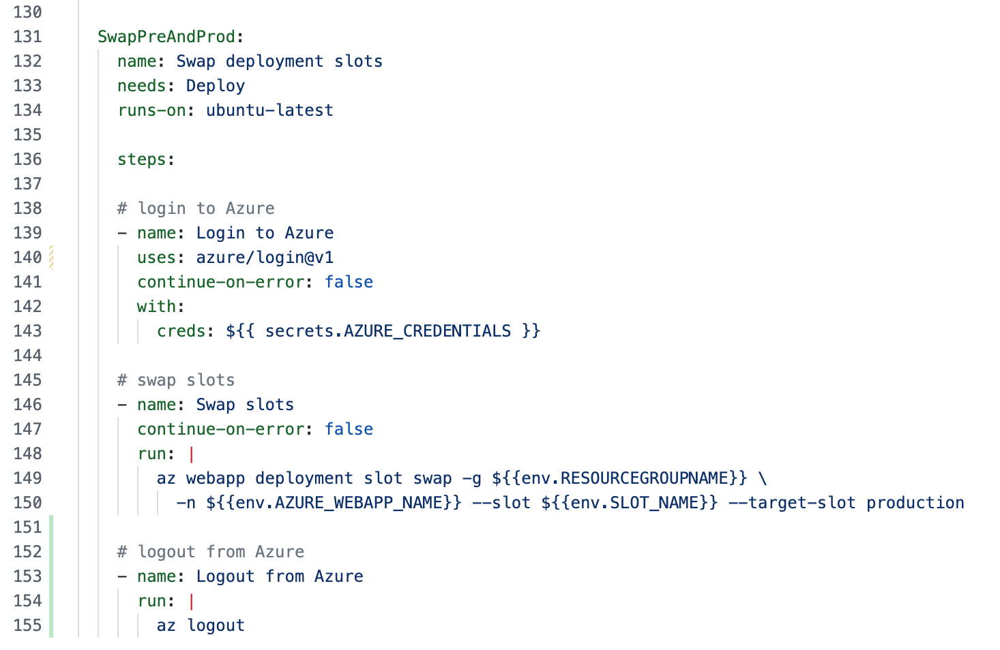

# Azure Dev Day - DevOps with GitHub lab

In this lab we're going to see how easy it is to create a functional Azure Web App with its source code stored in GitHub and a GitHub CICD workflow that builds and deploys the web app. . . in just a matter of minutes.
## Create an Azure DevOps Starter Project

1. Open a browser and sign into the Microsoft Azure Portal at <https://portal.azure.com>
1. In the **search bar**, type **DevOps Starter** and then either **press Return** or **click on DevOps Starter** under **Services**
    
1. Click on **+ Create**

    
1. On the next screen, **make sure that the DevOps Starter is going to use GitHub.** If it isn't, click on the **change settings here** link.

    
1. For this lab, create a Node.js web app that uses Express.js, and runs as a Windows Web App.
    1. Select the **Node.js** box.
    1. Click **Next: Framework >**
        
    1. Select the **Express.js** box. There's no need to add a database. 
    1. Click **Next: Service >**
        
    1. Select the **Windows Web App** box. 
    1. Select **Next: Create >**
        

    1. Click **Authorize** to allow Azure to access your GitHub account & create the workflow.
        
    1. Enter your GitHub Organization, Repository, Azure SubScription, Web app name, and Location. 
    1. Click **Review + Create**
        

    Note: It will take a few minutes to create the Azure and GitHub resources. Go grab a soda or some coffee. 

1. Once the deployment completes, click on **Go to resource** to view the deployment. 
    

## View your DevOps Starter project and create a Deployment slot

1. Click on **Authorize** to allow Azure to access your GitHub account to view the latest workflow execution and status of jobs
    
1. Cick on **Authorize** to finish connecting your GitHub account.
    
1. At this point you can see the GitHub workflow and the Azure resources that were created.
1. Click on your App Service name to go to the App Service definition in the Azure portal.
    
1. To create the deployment slot, 
    
    1. Click on **Deployment slots**
    1. Click on **+ Add Slot**  
    1. Name the slot **"pre-prod"** NOTE: You'll use the slot name later on when you update your CICD pipeline.
    1. Choose Clone settings from: **{your production slot name}**
    1. Click **Add**.
    1. It will take a minute or so to create the pre-prod slot. Once it finishes, click **Close** at the boottom of that window.

### You should now see two slots, the production slot and the new, pre-prod slot

## Update your GitHub workflow to deploy to the pre-prod slot

1. **Open a new tab** and go to your GitHub account. https://github.com/{your-gh-account}
1. Click on **Repositories** to view your repositories. 
    
1. Open the repository that the DevOps Starter created for you by clicking on its name. It's name is the same as the name of the App Service you created. 
    
1. Open the CICD workflow. 
    1. Click on **.github/workflows** 
    
    1. On the page that opens up, Click on **devops-starter-workflow.yml** to see the CICD pipeline that was created by the DevOps Starter project. 
    

    The workflow contains three jobs. **build**, **Deploy**, and **FunctionalTests**. We're going to update the workflow to add a slot swap action.

1. Enter edit mode by clicking on the **pencil icon** at the top right of the file listing. 
    
1. Add an environment variable called **SLOT_NAME:** with the value of **"pre-prod"**. Be sure to indent the variable the same as the other enviromnent variables.
    
1. Modify the web app deploy action to deploy to the pre-prod slot instead of the production slot. (It should be on line 123 or so.)
    1. Change the comment to **Deploy web app to pre-prod slot**
    1. Change the name of the action to **'Deploy to Azure WebApp pre-prod slot'**
    1. After the **package:** attribute, add a blank line and type **slot-name: ${{ env.SLOT_NAME }}** (Be sure the slot-name: attribute is indented the same as the package: attribute.)
    
1. Update the **Run Functional Tests** action to run against the **pre-prod** slot, by adding the new environment variable to the website's URL. *Don't forget to include a dash between the web app name and the slot name so it looks similar to this:*
    

## Commit the changes and watch the updated workflow run

1. In the upper right of the page, 1) click on **Start commit**, 2) enter a commit message, and 3) click on **commit changes**. Note that your workflow will immediately start running since it's configured to run anytime anything is pushed to the master branch.

    

1. Click on **Actions** to see the workflow runs.
    

1. Click on the latest workflow to see it running. It will take several minutes to complete. Note: In this view, the workflow will be whatever you typed for your commit message. 
    
1. You'll see the current state of the three jobs that are in the workflow.
    

    You can click on each job name within the run to see the log messages for it.
    

1. Once the workflow completes, switch back to the Azure Portal tab and from the Deployment slots view, click on the pre-prod slot link, then click on the URL for the pre-prod website. 

    You should see the Success message on the pre-prod site.  

    
## Extra credit
Update the workflow to do a slot swap, to swap the production and pre-prod slots, then make a change to the website. Basic outline: 

1. Add new job to the end of the workflow. Be sure to add "needs: FunctionalTests" to make sure it runs after the FunctionalTests job completes. 
1. Add a login to Azure action
1. Add a swap slots action (you'll need to use the Azure CLI to run the command). 

    The newly added job should look similar to this:

    

1. Comment out the ARM Template deploy action. (If you don't do this, your pipeline will fail.)
    

1. In the file **Application/views/index.pug** change the **.success-text** message to something such as **p Version 100 - Success!!**

    
1. Commit the change.
1. Watch the workflow run.
1. Once the workflow completes, check the pre-prod website and the production website. The production website should have the new version message, and the pre-prod slot will have the old message. 
