# Azure Dev Day - Web Apps with App Service

**Overview**: 

- [Requirements](#requirements)
- [Step 1: Deploy resources to Azure](#step-1-deploy-resources-to-azure)
- [Step 2: Setup application configuration](#step-2-setup-application-configuration)
- [Step 3: Deploy GitHub application](#step-3-deploy-github-application)
- [Step 4: Troubleshooting application issues](#step-4-troubleshooting-application-issues)
- [Step 5: Fixing connectivity issues](#step-5-fixing-connectivity-issues)
- [Step 6: Clean up resources](#step-6-clean-up-resources)

## Objectives 

Hosting a Web app in App Services is a great way for developers to leverage the power of Azure cloud without the need to architect complex infrastructure and networking setup but at the same time take advantage of capabilities like security, load balancing, autoscaling, automated management and continuous deployment to name a few.

During this lab you will learn to:

- Deploy a sample app hosted in a public GitHub repo.
- Setup application configuration and environment variables.
- Learn how to troubleshoot deployments issues.
- Running application checks and next steps.

**NOTE: This exercise is a section of a day-long workshop on Azure Dev Day, the complete workshop labs may be found [here](https://aka.ms/azuredevdaylabs).**

## Requirements

This lab assumes the user already has an Azure subscription with contributor access.

To get a free account click here: [Get an Azure free account](https://azure.microsoft.com/en-us/free)

## Step 1: Deploy resources to Azure 

We’ll start by deploying the necessary resources in Azure, CTRL+click (on Windows and Linux) or CMD+click (on MacOS) the button below to open the Azure custom deployment form in a new tab.

You should see a form like this:

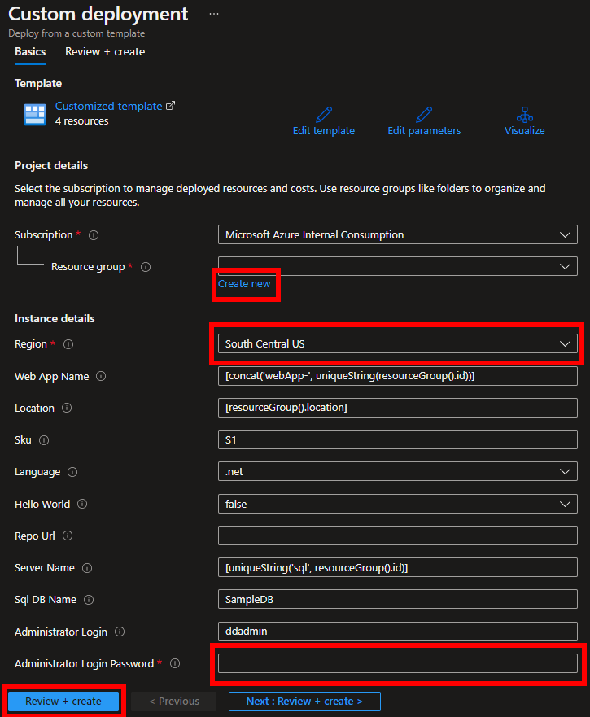

Add the following fields:

1. Click **Create new** Resource group and add a name for example **web-app-dev-day**
2. Select the Region closest to your physical location.
3. Type the Administrator Login Password for the Azure SQL resource that will be deployed together with the Azure App Service resource.

The rest of the fields can be left with the default values.

Click the **Review + Create** button at the bottom of the form.

Once the deployment is complete, click the ‘Go to resource group’ button.

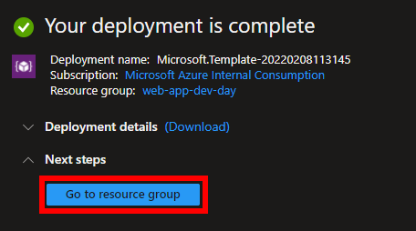

## Step 2: Setup application configuration

Within the resource group you should see 4 resources: App Service plan, App Service, SQL Server and  SQL database.

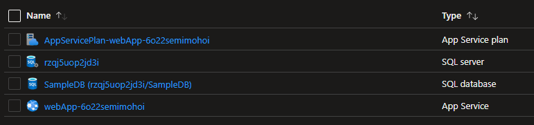

We'll confirm our App Service is up and running by clicking on the App Service **webApp-\<uniqid>**. This will open the **Overview** section of the App Service where you can see important information like Status, **URL**, Metrics, etc.

From this view click on the **URL** link, it will take you to the newly deployed App Service.

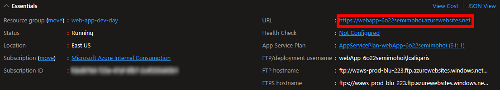

You should see a web page similar to the image below, this is only a stub page and we’ll be deploying a **Todo** MVC application next.

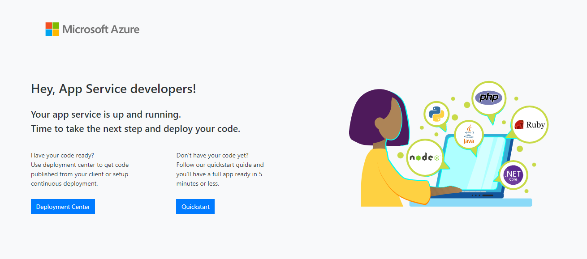

Go back to your Azure portal page and navigate back to the resource group view, you can accomplish this by clicking in the Resource group name from the **Overview** section.

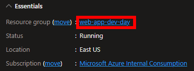

The **Todo** app requires a connection to an Azure SQL database and before deploying our code from GitHub, we’ll be setting up the connection string environment variable in our App Service application. This is the only application requirement from the Todo app.

From the list of resources in your **resource group** click on the **SQL database** resource, if you left the default value it should be named **SampleDB**.
From the **Overview** page of the database click on the **Show database connection strings**.

From the ADO.NET tab copy the connection string text, for convenience you can click the **Copy to clipboard** icon.

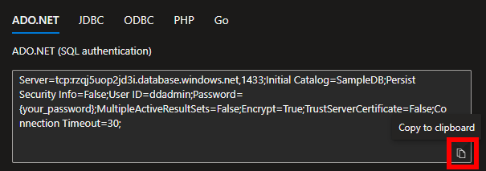

Navigate back to the App Service resource **webApp-\<uniqid>** and from the menu blade navigate from **Overview** to **Settings -> Configuration**.

On the **Application settings** tab click **+ New connection string**.

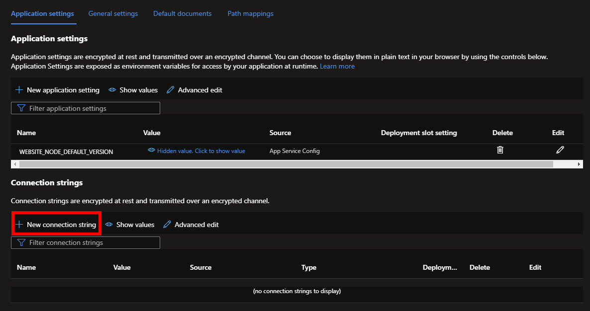

On the **Add/Edit connection string** pop up window:
- Name: **MyDbConnection**
- Value: Paste the connection string value you copied from the SQL database, once pasted look for the section **Password={your_password};**. Replace {your_password} including the brackets with the password you typed in the step 1 in the **Administrator Login Password**, leave the semicolon at the end of the password.
- Type: **SQLAzure**

Click the **OK** button

**NOTE: Storing connection strings or any key in clear text in environment variables IS NOT the recommended approach for a production application, for securely storing secrets, keys and certs please refer to the following doc: [Use Key Vault references for App Services]( https://docs.microsoft.com/en-us/azure/app-service/app-service-key-vault-references).**

You should see the new connection string environment variable back in the **Application settings** tab. Click the **Save** button from the top menu, a confirmation pop window will ask to **Continue** or **Cancel** the changes, click **Continue**. 

## Step 3: Deploy GitHub application

From the menu blade navigate to the **Deployment -> Deployment Center**.

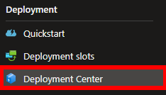

On the **Settings** tab, select **External Git** as a **Source** from the drop down list

On the **External Git** section:
- Repository: **https://github.com/caligaris/todomvc-dev-day.git**
- Branch: **main**

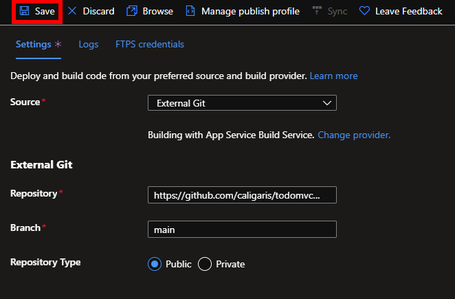

On the same **Deployment Center** section click on the **Logs** tab, from here you’ll be able to get information on the deployment process. Click the **Refresh** button if you don’t see the record indicating the deployment is in progress.

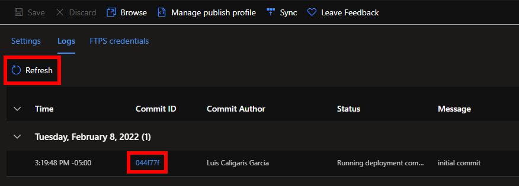

Once you see the deployment **Commit ID** click on it for additional logging information of the deployment process.

## Step 4: Troubleshooting application issues

Go to the application **URL** that you opened in **Step 2** and refresh the web page, you no longer see the stub web page and you should be getting an **HTTP 500 Error**.

Let’s troubleshoot this issue, when running locally or in a VM the first step is to look into the application logs, in Azure App Services you can also access your application logs in different ways. 

Without closing the error page, go back to the Azure portal and on the Azure App Service menu blade scroll down to the **Monitoring -> Log Stream**

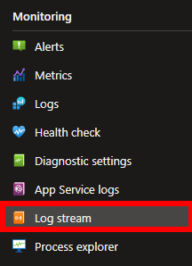

You will see a window similar to the image below that will let you know when you are connected to the log-stream service.

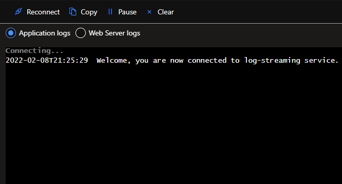

Without closing this window, navigate to the error page and refresh the browser, go back to the window with the log-stream and scroll to the top of the window, can you identify what the problem might be? 

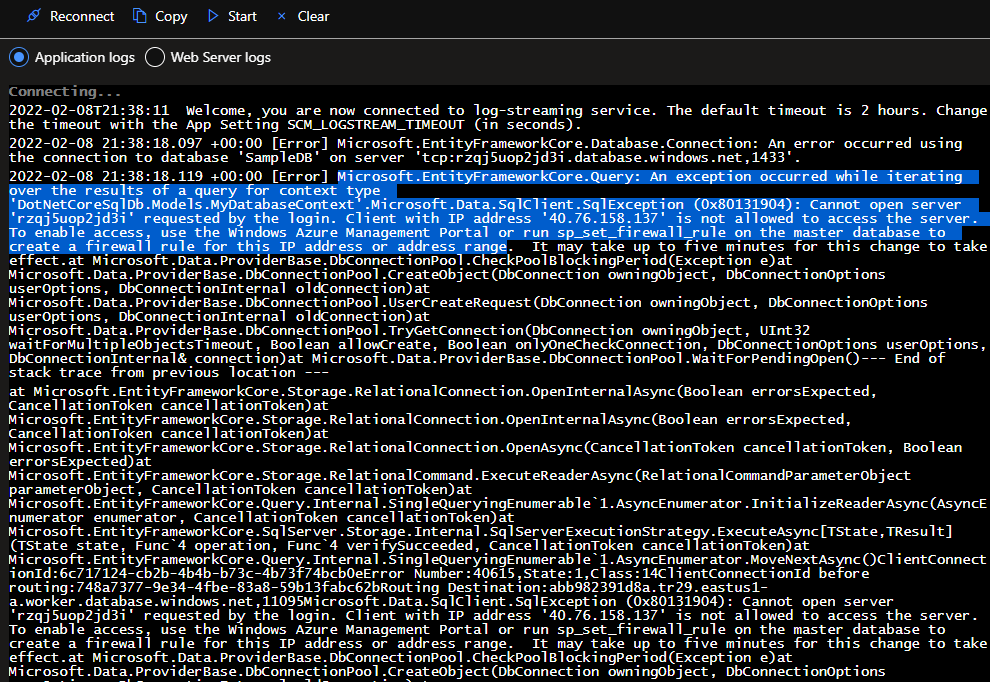

## Step 5: Fixing connectivity issues

Azure SQL will not allow connection to the server unless the service/IP has been whitelisted, navigate to the resource group **web-app-dev-day** from the Overview section in the menu blade and this occasion select the **SQL Server**.

In the **SQL Server** menu blade scroll down and go to **Security -> Firewalls and virtual networks**, if you don’t see this option make sure you selected the **SQL Server** and not the SQL Database in the resource group list.

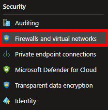

Toggle the **Allow Azure services and resources to access this server** switch to **Yes** and click the **Save** button on top.

Azure SQL has several access controls features, for more details on these go to [Azure SQL network access controls]( https://docs.microsoft.com/en-us/azure/azure-sql/database/network-access-controls-overview).

Navigate back to the **Azure App Service** resource and from the **Overview** section and on the right-hand side click the **Restart** button and **Yes** on the confirmation window.

Finally go back to the browser window with the error page and refresh. After a few seconds you should see **My TodoList App** up and running. You should be able to create, read, update and delete to-do tasks.

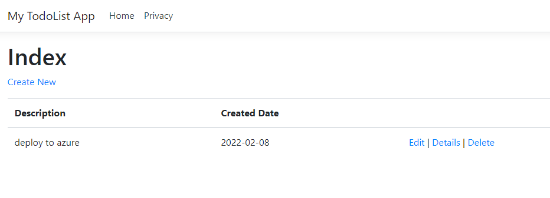

## Step 6: Clean up resources
From the **App Service** view in the **Overiew** section click on the **Resource Group** name.

From the top menu in the rght side click **Delete resource group**

In the confirmation window type the resource group name **web-app-dev-day** and click **Delete** at the bottom.

