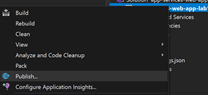

# Web Apps with App Service Lab

This lab walks through deployment of an ASP.NET workload to Azure App Service using Visual Studio. If you would like to try a different language/toolset, refer to the following:
* [Node.js](https://docs.microsoft.com/en-us/azure/app-service/quickstart-nodejs?pivots=platform-linux)
* [Java](https://docs.microsoft.com/en-us/azure/app-service/quickstart-java?tabs=javase&pivots=platform-linux)
* [Python](https://docs.microsoft.com/en-us/azure/app-service/quickstart-python?tabs=bash&pivots=python-framework-flask)
* [.NET with VS Code](https://docs.microsoft.com/en-us/azure/app-service/quickstart-dotnetcore?tabs=netcore31&pivots=development-environment-vscode)

## Objectives
1.	Demo how easy to deploy a web workload to Azure App Services
1.	Demo the steps to create a development environment on Azure for free
1.	Demo how to re-deploy your App Service after developers make changes locally
1.	Demo how to connect to other Azure Services like Azure Managed SQL Server

## Prerequisites
1. Azure Subscription
1. Windows 10
1. Microsoft Visual Studio 2019 - [Download](https://visualstudio.microsoft.com/downloads/)
    1. Install: ASP.NET and Web Development Workload
    1. Install: Azure Development Workload
    1.	Install: .NET Cross-platform Applications using .NET, ASP.NET Workload
 
4. Microsoft .NET 5 SDK - [Download](https://dotnet.microsoft.com/download/dotnet/5.0)

## Steps
1. Login to the Azure Portal at https://portal.azure.com
1. Create a new Resource Group [rg-app-services-lab1]
1. Once the new Resource Group gets created, click on the new Resource Group, and create a new resource 
1. Create App Service Plan 
    1. Resource Group: [rg-app-services-lab1]
    1. Name: [asp-app-services-lab1]
    1. Operating System: [Windows]
    1. Region: [South Central US]
    1. Sku and Size: [Free F1]
1.	Create Web App 
    1. Resource Group: [rg-app-services-lab1]
    1. Name: [webapp1-ms-wa1234-app-services-lab1]
    1. Publish: [Code]
    1. Runtime stack: [.NET 5]
    1. Operating System: [Windows]
    1. Region: [South Central US]
    1. App Service Plan: [asp-app-services-lab1]
1.	After you finish creating the Azure resources, Azure is ready to deploy your first App Service.
1.	Launch Visual Studio 2019 on your desktop and create a new project, and choose:
[ASP.NET Core Web App] project type, then click on the Next button:
    
1. Enter Project Name: [app-services-web-app-lab1], then click the Next button.
1. Choose the Target Framework: [.NET 5.0], then click the Next button.
1. Run the template web app, and make sure it is working fine locally.
1. Right-click on the project name, and choose the [Publish] menu item:
    
1. Choose publish Target [Azure] , then click on the Next button:
    
1. Choose the Specific Target [Azure App Service (Windows)], then click on the Next button:
    
1. Choose your Azure subscription, and the correct App Service Instance:
    
1. Click on the Finish button.
1. Now the publish deploy configuration is ready to be published on Azure. Press on the Publish button:
    
1. After building, packaging, and publishing to Azure the default browser should launch and the Azure App Service URL will be there with the web site running on it:
    
1. Congratulations! You have successfully published your first App Service on Azure!

## Lab Cleanup	
1. If you want to clean up your account, then go to the Azure portal and click on the [rg-app-services-lab1] resource group.
1. Click on the Delete resource group menu item.
1. Type the resource group name [rg-app-services-lab1] to confirm the delete all the resources under that resource group. 
1. In few minutes Azure will delete all the resource you created in this lab.
